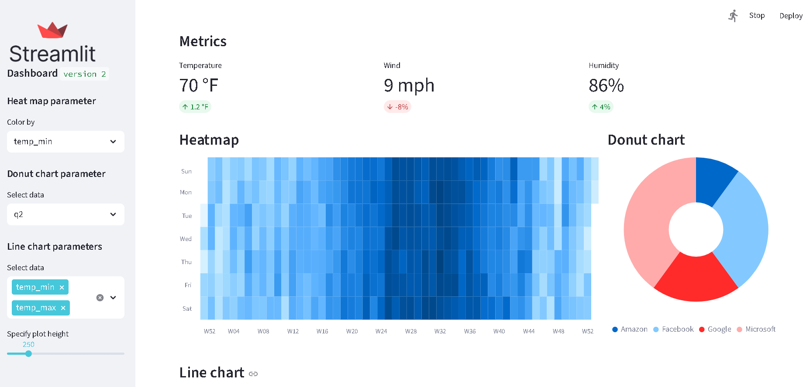

# 📊 Streamlit Visualization Dashboard


An interactive dashboard built with **Python**, **Streamlit**, and **Plost**. This project demonstrates how to build a responsive layout with sidebar controls, custom CSS styling, and various data visualization techniques including Heatmaps, Donut charts, and Line charts.

## 🖼️ Preview



## 🚀 Features

The application features a "wide" layout with an expanded sidebar for user controls:

- **Key Metrics:** Real-time display of Temperature, Wind, and Humidity (static example data).
- **Interactive Heatmap:** Visualizes Seattle weather patterns over time.
  - *Control:* Toggle coloring by Minimum (`temp_min`) or Maximum (`temp_max`) temperature.
- **Donut Chart:** Displays stock distribution data.
  - *Control:* Switch between quarters (`q2` or `q3`).
- **Line Chart:** Tracks weather trends.
  - *Control:* Multi-select data to compare (`temp_min`, `temp_max`) and adjust graph height via a slider.
- **Custom Styling:** Integrates external CSS for UI enhancements.

## 🛠️ Tech Stack

- **[Streamlit](https://streamlit.io/):** The core framework for the web application.
- **[Pandas](https://pandas.pydata.org/):** Used for data manipulation and CSV reading.
- **[Plost](https://github.com/tvst/plost):** A wrapper around Altair to simplify plotting in Streamlit.

## 📂 Project Structure

```text
├── style.css            # Custom CSS styling file
├── dashboard.py         # Main application script
├── README.md            # Project documentation
└── requirements.txt     # Python dependencies